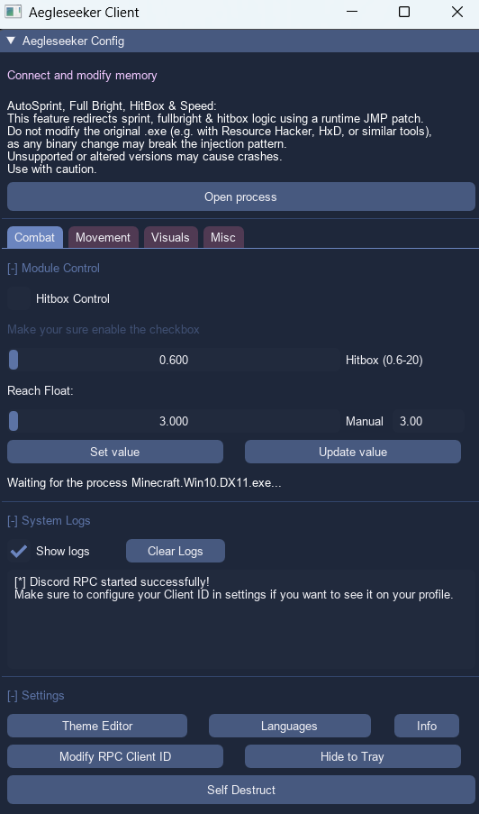

# Aegleseeker Client

A hack client for **Minecraft: Windows 10 Edition Beta** 0.15.10.
## GUI Preview

<p align="center">
  
</p>
---

## Installation

### Step 1

Install Git Bash: [click here](https://git-scm.com/downloads)

### Step 2

Open CMD or PowerShell and execute this command:

```bash
git clone https://github.com/iVyz3r/aegleseeker.git
```

### Step 3

Open the project:

```bash
cd aegleseeker
```

### Step 4

Execute **build.bat** or **ps-build.ps1**

---

## Comments

Help improve the project by posting ideas to make a better client for Minecraft Beta.

Discord:

* notvyzer

---

## License

This project is licensed under the **MIT License**.
See the [LICENSE](LICENSE) file for details.
